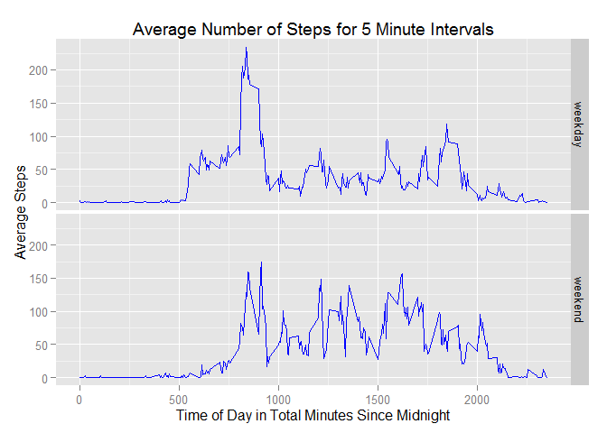

# Reproducible Research: Peer Assessment 1

## Loads the neccessary packages

```r
library(dplyr)
```

```
## 
## Attaching package: 'dplyr'
## 
## The following objects are masked from 'package:stats':
## 
##     filter, lag
## 
## The following objects are masked from 'package:base':
## 
##     intersect, setdiff, setequal, union
```

```r
library(ggplot2)
```

## Loading and preprocessing the data

```r
# Checks to see if the zip file has been downloaded and if it hasn't it downloads it
if (!file.exists("activity.zip")){
    download.file("https://d396qusza40orc.cloudfront.net/repdata%2Fdata%2Factivity.zip",
                  method="libcurl", destfile = "activity.zip")
}

# Checks to see if the file has been unzipped and if it hasn't it unzips it
if (!file.exists("activity.csv")){
    unzip("activity.zip")    
}

# Reads the data with the the correct classes for each column
ActivityData <- read.csv("activity.csv", colClasses = c("numeric", "Date", "numeric"))
```

## What is mean total number of steps taken per day?

```r
# I interpreted ignoring the NA values to mean removing them from the data
ActivityRemoveNA <- filter(ActivityData, !is.na(ActivityData$steps))
SumStepsByDate <- ActivityRemoveNA %>% 
    group_by(date) %>% 
    summarize(totalsteps = sum(steps))
print.data.frame(SumStepsByDate)
```

```
##          date totalsteps
## 1  2012-10-02        126
## 2  2012-10-03      11352
## 3  2012-10-04      12116
## 4  2012-10-05      13294
## 5  2012-10-06      15420
## 6  2012-10-07      11015
## 7  2012-10-09      12811
## 8  2012-10-10       9900
## 9  2012-10-11      10304
## 10 2012-10-12      17382
## 11 2012-10-13      12426
## 12 2012-10-14      15098
## 13 2012-10-15      10139
## 14 2012-10-16      15084
## 15 2012-10-17      13452
## 16 2012-10-18      10056
## 17 2012-10-19      11829
## 18 2012-10-20      10395
## 19 2012-10-21       8821
## 20 2012-10-22      13460
## 21 2012-10-23       8918
## 22 2012-10-24       8355
## 23 2012-10-25       2492
## 24 2012-10-26       6778
## 25 2012-10-27      10119
## 26 2012-10-28      11458
## 27 2012-10-29       5018
## 28 2012-10-30       9819
## 29 2012-10-31      15414
## 30 2012-11-02      10600
## 31 2012-11-03      10571
## 32 2012-11-05      10439
## 33 2012-11-06       8334
## 34 2012-11-07      12883
## 35 2012-11-08       3219
## 36 2012-11-11      12608
## 37 2012-11-12      10765
## 38 2012-11-13       7336
## 39 2012-11-15         41
## 40 2012-11-16       5441
## 41 2012-11-17      14339
## 42 2012-11-18      15110
## 43 2012-11-19       8841
## 44 2012-11-20       4472
## 45 2012-11-21      12787
## 46 2012-11-22      20427
## 47 2012-11-23      21194
## 48 2012-11-24      14478
## 49 2012-11-25      11834
## 50 2012-11-26      11162
## 51 2012-11-27      13646
## 52 2012-11-28      10183
## 53 2012-11-29       7047
```

```r
g <- ggplot(SumStepsByDate, aes(x=totalsteps)) 
g + geom_histogram(colour = "white", fill = "blue") + 
    labs(x = "Total Daily Steps", title = "Histogram of Total Daily Steps") + 
    scale_y_continuous(breaks=seq(0,10,2)) 
```

```
## stat_bin: binwidth defaulted to range/30. Use 'binwidth = x' to adjust this.
```

 

```r
mean(SumStepsByDate$totalsteps)
```

```
## [1] 10766.19
```

```r
median(SumStepsByDate$totalsteps)
```

```
## [1] 10765
```

## What is the average daily activity pattern?

```r
ActivityPattern <- ActivityRemoveNA %>%
    group_by(interval) %>%
    summarize(meansteps = mean(steps))

g2 <- ggplot(ActivityPattern, aes(x=interval, y=meansteps))
g2 + geom_line(color = "blue") + 
    labs(x = "Time of Day in Total Minutes Since Midnight", 
         y = "Average Steps",
         title = "Average Number of Steps for 5 Minute Intervals")
```

 

## Inputing missing values

```r
sum(is.na(ActivityData$steps))
```

```
## [1] 2304
```

```r
# Create a new data frame with the NA values replaced by the average for the interval
ActivityReplacedNA <- ActivityData %>%
    group_by(interval) %>%
    mutate(steps = ifelse(is.na(steps), mean(steps, na.rm=TRUE), steps))

SumStepsByDateReplaced <- ActivityReplacedNA %>% 
    group_by(date) %>% 
    summarize(totalsteps = sum(steps))

g <- ggplot(SumStepsByDateReplaced, aes(x=totalsteps)) 
g + geom_histogram(colour = "white", fill = "blue") + 
    labs(x = "Total Daily Steps", 
         title = "Histogram of Total Daily Steps with NA's Replaced ") + 
    scale_y_continuous(breaks=seq(0,10,2)) 
```

```
## stat_bin: binwidth defaulted to range/30. Use 'binwidth = x' to adjust this.
```

 

```r
mean(SumStepsByDateReplaced$totalsteps)
```

```
## [1] 10766.19
```

```r
median(SumStepsByDateReplaced$totalsteps)
```

```
## [1] 10766.19
```
The mean stayed the same over both data sets since I used the average value for 
the interval as the replacement value for the NA values.  The median shifted up 
slightly towards the mean since there is now more data and that data has a value 
equal to the mean.

## Are there differences in activity patterns between weekdays and weekends?

```r
WeekdayActivityData <- ActivityData %>%
    mutate(type = ifelse(weekdays(date)%in%c("Saturday", "Sunday"),"weekend","weekday"))

WeekdayActivityPattern <- WeekdayActivityData %>%
    group_by(type, interval) %>%
    summarize(meansteps = mean(steps, na.rm=TRUE))

g3 <- ggplot(WeekdayActivityPattern, aes(x=interval, y=meansteps))
g3 + geom_line(color = "blue") + facet_grid(type~.) +
    labs(x = "Time of Day in Total Minutes Since Midnight", 
         y = "Average Steps",
         title = "Average Number of Steps for 5 Minute Intervals")
```

 
